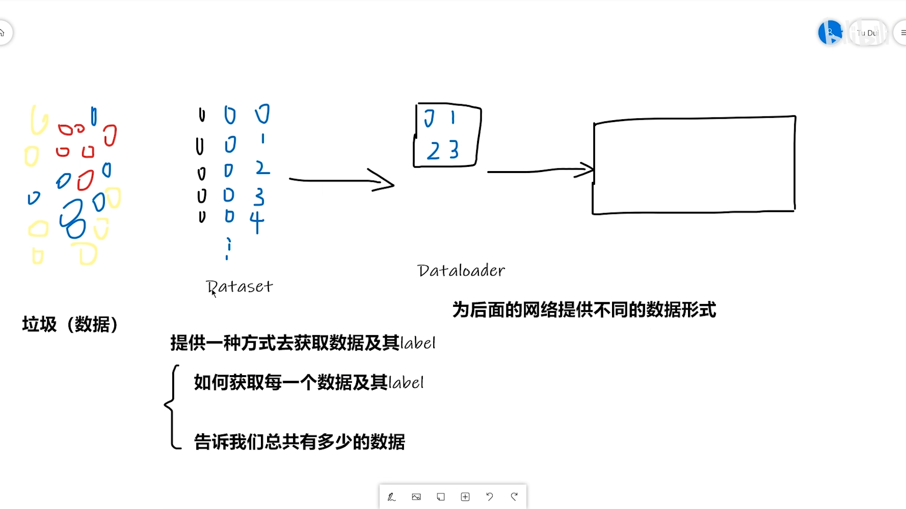

[TOC]

# 一、数据加载

## 1.1	Dataset & Dataloader

- **Dataset**：提供一种方式，获取`data`及其`label`

  - 如何获取单个`data`及其`label`
  - 计算总共有多少个`data`

  ```python
  from torch.utils.data import Dataset
  class MyDataset(Dataset):
      def __init__(self, data_path):
          ...
  
      def __len__(self):
          ...
      
      def __getitem__(self, index):
          ...
  ```

- **Dataloader**：将数据打包，提供给网络使用

