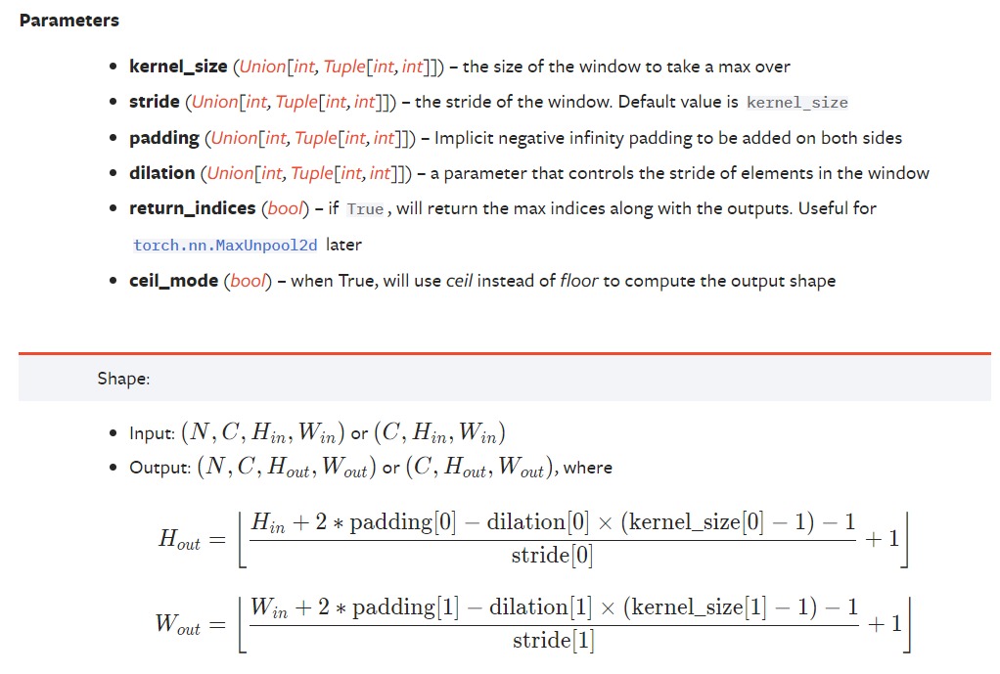

[TOC]

# 一、准备数据：Dataset & Dataloader

```python
from torch.utils.data import DataLoader, Dataset
```

## 1.1	Dataset：提供一种方式，获取data及其label

- 初始化：`__init(self, ...)__`
- 如何获取单个`data`及其`label`：`__getitem__(self, index)`
- 计算总共有多少个`data`：`__len__(self)`

```python
import os
from PIL import Image
from torch.utils.data import Dataset

class MyDataset(Dataset):
    def __init__(self, root_dir, label_dir):
        self.root_dir = root_dir
        self.label_dir = label_dir
        path = os.path.join(self.root_dir, self.label_dir)
        self.img_name_list = os.listdir(path)

    def __getitem__(self, index):
        img_name = self.img_name_list[index]
        img_path = os.path.join(self.root_dir, self.label_dir, img_name)
        img = Image.open(img_path)
        label = self.label_dir
        return img, label

    def __len__(self):
        return len(self.img_name_list)
```

## 1.2	Dataloader：将数据打包，提供给网络使用

https://pytorch.org/docs/stable/data.html#torch.utils.data.DataLoader


```python
import torchvision
from torch.utils.data import DataLoader
from torch.utils.tensorboard import SummaryWriter

# 测试数据集
test_data = torchvision.datasets.CIFAR10(root='./dataset', train=False, transform=torchvision.transforms.ToTensor())
if __name__ == '__main__':
    img, target = test_data[0]
    # print(img.shape)    # torch.Size([3, 32, 32])

# 测试数据集的加载器
test_loader = DataLoader(
    dataset=test_data,  # 数据集
    batch_size=64,      # 每个batch取多少个样本
    shuffle=True,       # 是否打乱
    num_workers=0,      # 读取的线程个数
    drop_last=True      # 是否丢弃最后一个batch
)
if __name__ == '__main__':
    writer = SummaryWriter('./logs')
    for epoch in range(2):
        step = 0
        for data in test_loader:
            imgs, targets = data
            # print(imgs.shape)   # torch.Size([batch_size, 3, 32, 32])
            writer.add_images('Epoch: {}'.format(epoch), imgs, step)
            step += 1
    writer.close()
```

# 二、记录日志：Tensorboard

```python
from torch.utils.tensorboard import SummaryWriter
```

## 2.1	Python生成日志文件

- 坐标轴：观察网络的`loss`

  ```python
  from torch.utils.tensorboard import SummaryWriter
  
  writer = SummaryWriter(
      log_dir='logs' # 存储路径, 建议每次训练使用不同的文件夹, 以免覆盖之前的训练结果
  )
  
  # 坐标轴
  for i in range(100):
      writer.add_scalar(
          tag='y=x^2',        # 坐标轴名称
          scalar_value=i**2,  # Y轴值
          global_step=i       # X轴值
      )
  
  writer.close()
  ```

- 图像：观察网络的图像输入or输出

  ```python
  # 图片
  img_path = 'data/train/ants/0013035.jpg'
  img_PIL = Image.open(img_path)
  img_array = np.array(img_PIL)
  writer.add_image(
      tag='test',             # 图片名称
      img_tensor=img_array,   # 图片数据
      global_step=0,          # 第几张图片
      dataformats='HWC'       # 图片数据格式(HWC:高度、宽度、通道数)
  )
  ```

## 2.2	使用Tensorboard打开日志文件：

```bash
tensorboard --logdir=logs --port=6007
```

查看port（如`6007`）被哪些进程占用：（可以得到进程PID）

```bash
netstat -ano | findstr 6007
```

查看PID（如`20288`）对应的进程

```bash
tasklist | findstr 20288
```

# 三、数据变换工具箱：Transforms

```python
from torchvision import transforms
```


## 3.1	将PIL图片转为Tensor类型

```python
from torchvision import transforms
from PIL import Image

# 1. 将PIL图片转换为Tensor
img_path = "data/train/ants/0013035.jpg"
img = Image.open(img_path)
img_tensor = transforms.ToTensor()(img)
```

- **Tensor**：包装了神经网络必须的一些属性
- **ToTensor()**：将PIL、ndarray格式的图片，转化为Tensor格式

## 3.2	常用Transforms

- **输入**：
  - **PIL**：`Image.open(path)`
  - **tensor**：`transforms.ToTensor()(PILImage)`
  - **ndarray**：`cv.imread(path)`
- **作用**
  - **将PIL、ndarray转化为Tensor**：`transforms.ToTensor()(PILImage)`
  - **将Tensor、ndarray转化为PIL**：`transforms.ToPILImage()(tensor)`
  - **按通道归一化Tensor图像**：`transforms.Normalize(mean, std)(tensor)`
  - **更改PIL图像大小**：`transforms.Resize(size)(PILImage)`
  - **组合多个作用**：`transforms.Compose([transform_1, transform_2...])`
  - **随机裁剪PIL图像**：`transforms.RandomCrop(size)(PILImage)`

# 四、官方数据集：torchvision.datasets

```python
import torchvision.datasets
```

## 4.1	CIFAR10数据集

```python
import torchvision
from torchvision import transforms
from torch.utils.tensorboard import SummaryWriter

dataset_transform = transforms.Compose([
    transforms.ToTensor()
])

# 使用torchvision数据集, 如果没有则下载
train_set = torchvision.datasets.CIFAR10(root='./dataset', train=True, transform=dataset_transform, download=True)
test_set = torchvision.datasets.CIFAR10(root='./dataset', train=False, transform=dataset_transform, download=True)

# 将数据集显示到tensorboard中
writter = SummaryWriter('./logs')
for i in range(10):
    img_tensor, label = train_set[i]
    writter.add_image('train_set', img_tensor, i)
writter.close()
```

# 五、神经网络的搭建：torch.nn

https://pytorch.org/docs/stable/nn.html

```python
import torch.nn
```

## 5.1	nn.Module：神经网络的模板

https://pytorch.org/docs/stable/generated/torch.nn.Module.html#torch.nn.Module

- 初始化：`__init(self, ...)__`
- 给定输入，如何得到输出：`__forward(self, input)__`

```python
import torch
import torchvision
from torch import nn
from torch.utils.data import DataLoader
from torch.utils.tensorboard import SummaryWriter

class MyModel(nn.Module):
    def __init__(self):
        super().__init__()

    def forward(self, input):
        output = input + 1
        return output

if __name__ == '__main__':
    dataset = torchvision.datasets.CIFAR10(root='./dataset', train=False, transform=torchvision.transforms.ToTensor(), download=True)
    dataloader = DataLoader(dataset, batch_size=64)
    model = MyModel()

    writer = SummaryWriter('./logs')
    step = 0
    for data in dataloader:
        img, target = data
        output = model(img)

        writer.add_images('input', img, step)
        writer.add_images('output', output, step)
        step += 1
    writer.close()
```

## 5.2	卷积层：`nn.Conv2d(...)`

> torch.nn是对torch.nn.functional的封装

### 5.2.1	卷积操作：`F.conv2d(...)`

- **convolution**：卷积

<table style="width:100%; table-layout:fixed;">
  <tr>
    <td></td>
    <td></td>
    <td></td>
    <td></td>
  </tr>
  <tr>
    <td>padding=0, stride=1</td>
    <td>padding=2, stride=1</td>
    <td>Half padding, stride=1</td>
    <td>Full padding, stride=1</td>
  </tr>
  <tr>
    <td></td>
    <td></td>
    <td></td>
    <td></td>
  </tr>
  <tr>
    <td>padding=0, stride=2</td>
    <td>padding=1, stride=2</td>
    <td>padding=1, stride=2 (odd)</td>
    <td></td>
  </tr>
</table>

- **Transposed convolution**

<table style="width:100%; table-layout:fixed;">
  <tr>
    <td></td>
    <td></td>
    <td></td>
    <td></td>
  </tr>
  <tr>
    <td>padding=0, stride=1, transposed</td>
    <td>Arbitrary padding, stride=1, transposed</td>
    <td>Half padding, stride=1, transposed</td>
    <td>Full padding, stride=1, transposed</td>
  </tr>
  <tr>
    <td></td>
    <td></td>
    <td></td>
    <td></td>
  </tr>
  <tr>
    <td>padding=0, strides, transposed</td>
    <td>Padding, strides, transposed</td>
    <td>Padding, strides, transposed (odd)</td>
    <td></td>
  </tr>
</table>

- **Dilated convolution**：空洞卷积

<table style="width:25%"; table-layout:fixed;>
  <tr>
    <td></td>
  </tr>
  <tr>
    <td>padding=0, stride=1, dilation</td>
  </tr>
</table>

- `input`：输入 (batch_size, in_channel, input_H, input_W)
- `weight`： 卷积核  (out_channel, in_channel/groups, kernel_H, kernel_W)
- `stride=1`：步长
- `padding=0`：填充

```python
import torch
import torch.nn as nn
import torch.nn.functional as F

input = torch.tensor(
    [[1, 2, 0, 3, 1],
    [0, 1, 2, 3, 1],
    [1, 2, 1, 0, 0],
    [5, 2, 3, 1, 1],
    [2, 1, 0, 1, 1]])

kernel = torch.tensor(
    [[1, 2, 1],
    [0, 1, 0],
    [2, 1, 0]])

input = input.view(1, 1, 5, 5)

kernel = kernel.view(1, 1, 3, 3)

output = F.conv2d(input, kernel, stride=1, padding=1)
```

### 5.2.2	卷积层：`nn.Conv2d(...)`

https://pytorch.org/docs/stable/generated/torch.nn.Conv2d.html#torch.nn.Conv2d

- `in_channels`：输入图像的通道数（彩色图像通常为3个）
- `out_channels`：输出图像的通道数
- `kernel_size`： 卷积核大小
  - 在给定卷积核大小后，初始卷积核权重是从某个特定分布中采样出来的
  - 后续训练时，会改变卷积核权重
- `stride=1`：步长
- `padding=0`：填充
- `dilation=1`：卷积核每个位之间的距离【通常为1】
- `groups=1`：分组卷积的分组数【通常为1】
- `bias=True`：是否有偏置【通常为True】
- `padding_mode='zeros'`：填充的默认值

> 

### 5.2.3	使用示例

```python
class MyModel(nn.Module):
    def __init__(self):
        super(MyModel, self).__init__()
        self.conv1 = nn.Conv2d(in_channels=3, out_channels=6, kernel_size=3, stride=1, padding=0 )
    
    def forward(self, x):
        x = self.conv1(x)
        return x
```

## 5.3	最大池化层：`nn.MaxPool2d(...)`

> 可以视为：下采样操作
>
> 作用：保留数据特征，同时减小数据量

### 5.3.1	最大池化操作


### 5.3.2	最大池化层：`nn.MaxPool2d(...)`

https://pytorch.org/docs/stable/generated/torch.nn.MaxPool2d.html#torch.nn.MaxPool2d

- `kernel_size`： 池化核大小
- `stride=kernel_size`：步长
- `padding=0`：填充
- `dilation=1`： 池化核每个位之间的距离【通常为1】
- `return_indices=False`
- `ceil_mode=False`：是否为ceil模式(保留边界)

> 

### 5.3.3	使用示例

```python
class MyModel(nn.Module):
    def __init__(self):
        super(MyModel, self).__init__()
        self.maxpool1 = nn.MaxPool2d(kernel_size=3, ceil_mode=True)
    
    def forward(self, x):
        x = self.maxpool1(x)
        return x
```

## 5.4	非线性激活层

https://pytorch.org/docs/stable/nn.html#non-linear-activations-weighted-sum-nonlinearity

作用：为网络引入非线性特征，便于学习

- `inplace=False`：是否修改input的值

### 5.4.1	ReLU：`nn.ReLU(inplace=False)`

https://pytorch.org/docs/stable/generated/torch.nn.ReLU.html#torch.nn.ReLU


```python
m = nn.ReLU()
input = torch.randn(2)
output = m(input)
```

### 5.4.2	Sigmoid：`nn.Sigmoid(inplace=False)`

https://pytorch.org/docs/stable/generated/torch.nn.Sigmoid.html#torch.nn.Sigmoid


```python
m = nn.Sigmoid()
input = torch.randn(2)
output = m(input)
```

### 5.4.3	使用示例

```python
class MyModel(nn.Module):
    def __init__(self):
        super(MyModel, self).__init__()
        self.relu = nn.ReLU()
        self.sigmoid = nn.Sigmoid()
    def forward(self, x):
        x = self.sigmoid(x)
        return x
```

