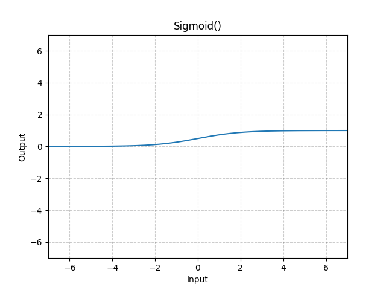

[TOC]

# 【数据准备】

## 一、准备数据：Dataset & Dataloader

```python
from torch.utils.data import DataLoader, Dataset
```

### 1.1	Dataset：提供一种方式，获取data及其label

- 初始化：`__init(self, ...)__`
- 如何获取单个`data`及其`label`：`__getitem__(self, index)`
- 计算总共有多少个`data`：`__len__(self)`

```python
import os
from PIL import Image
from torch.utils.data import Dataset

class MyDataset(Dataset):
    def __init__(self, root_dir, label_dir):
        self.root_dir = root_dir
        self.label_dir = label_dir
        path = os.path.join(self.root_dir, self.label_dir)
        self.img_name_list = os.listdir(path)

    def __getitem__(self, index):
        img_name = self.img_name_list[index]
        img_path = os.path.join(self.root_dir, self.label_dir, img_name)
        img = Image.open(img_path)
        label = self.label_dir
        return img, label

    def __len__(self):
        return len(self.img_name_list)
```

### 1.2	Dataloader：将数据打包，提供给网络使用

https://pytorch.org/docs/stable/data.html#torch.utils.data.DataLoader


```python
import torchvision
from torch.utils.data import DataLoader
from torch.utils.tensorboard import SummaryWriter

# 测试数据集
test_data = torchvision.datasets.CIFAR10(root='./dataset', train=False, transform=torchvision.transforms.ToTensor())
if __name__ == '__main__':
    img, target = test_data[0]
    # print(img.shape)    # torch.Size([3, 32, 32])

# 测试数据集的加载器
test_loader = DataLoader(
    dataset=test_data,  # 数据集
    batch_size=64,      # 每个batch取多少个样本
    shuffle=True,       # 是否打乱
    num_workers=0,      # 读取的线程个数
    drop_last=True      # 是否丢弃最后一个batch
)
if __name__ == '__main__':
    writer = SummaryWriter('./logs')
    for epoch in range(2):
        step = 0
        for data in test_loader:
            imgs, targets = data
            # print(imgs.shape)   # torch.Size([batch_size, 3, 32, 32])
            writer.add_images('Epoch: {}'.format(epoch), imgs, step)
            step += 1
    writer.close()
```

## 二、记录日志：Tensorboard

```python
from torch.utils.tensorboard import SummaryWriter
```

### 2.1	Python生成日志文件

- 坐标轴：观察网络的`loss`

  ```python
  from torch.utils.tensorboard import SummaryWriter
  
  writer = SummaryWriter(
      log_dir='logs' # 存储路径, 建议每次训练使用不同的文件夹, 以免覆盖之前的训练结果
  )
  
  # 坐标轴
  for i in range(100):
      writer.add_scalar(
          tag='y=x^2',        # 坐标轴名称
          scalar_value=i**2,  # Y轴值
          global_step=i       # X轴值
      )
  
  writer.close()
  ```

- 图像：观察网络的图像输入or输出

  ```python
  # 图片
  img_path = 'data/train/ants/0013031.jpg'
  img_PIL = Image.open(img_path)
  img_array = np.array(img_PIL)
  writer.add_image(
      tag='test',             # 图片名称
      img_tensor=img_array,   # 图片数据
      global_step=0,          # 第几张图片
      dataformats='HWC'       # 图片数据格式(HWC:高度、宽度、通道数)
  )
  ```

### 2.2	使用Tensorboard打开日志文件：

```bash
tensorboard --logdir=logs --port=6007
```

查看port（如`6007`）被哪些进程占用：（可以得到进程PID）

```bash
netstat -ano | findstr 6007
```

查看PID（如`20288`）对应的进程

```bash
tasklist | findstr 20288
```

## 三、数据变换工具箱：Transforms

```python
from torchvision import transforms
```


### 3.1	将PIL图片转为Tensor类型

```python
from torchvision import transforms
from PIL import Image

# 1. 将PIL图片转换为Tensor
img_path = "data/train/ants/0013031.jpg"
img = Image.open(img_path)
img_tensor = transforms.ToTensor()(img)
```

- **Tensor**：包装了神经网络必须的一些属性
- **ToTensor()**：将PIL、ndarray格式的图片，转化为Tensor格式

### 3.2	常用Transforms

- **输入**：
  - **PIL**：`Image.open(path)`
  - **tensor**：`transforms.ToTensor()(PILImage)`
  - **ndarray**：`cv.imread(path)`
- **作用**
  - **将PIL、ndarray转化为Tensor**：`transforms.ToTensor()(PILImage)`
  - **将Tensor、ndarray转化为PIL**：`transforms.ToPILImage()(tensor)`
  - **按通道归一化Tensor图像**：`transforms.Normalize(mean, std)(tensor)`
  - **更改PIL图像大小**：`transforms.Resize(size)(PILImage)`
  - **组合多个作用**：`transforms.Compose([transform_1, transform_2...])`
  - **随机裁剪PIL图像**：`transforms.RandomCrop(size)(PILImage)`

## 四、官方数据集：torchvision.datasets

```python
import torchvision.datasets
```

### 4.1	CIFAR10数据集

https://pytorch.org/vision/stable/generated/torchvision.datasets.CIFAR10.html#torchvision.datasets.CIFAR10

https://www.cs.toronto.edu/~kriz/cifar.html


```python
import torch
import torch.nn as nn
from torch.utils.tensorboard import SummaryWriter

class MyModel(nn.Module):
    def __init__(self):
        super(MyModel, self).__init__()
        # input: 3 @ 32 x 32
        self.conv1 = nn.Conv2d(in_channels=3, out_channels=32, kernel_size=5, padding=2)
        # feature map: 32 @ 32 x 32
        self.maxpool1 = nn.MaxPool2d(kernel_size=2)
        # feature map: 32 @ 16 x 16
        self.conv2 = nn.Conv2d(in_channels=32, out_channels=32, kernel_size=5, padding=2)
        # feature map: 32 @ 16 x 16
        self.maxpool2 = nn.MaxPool2d(kernel_size=2)
        # feature map: 32 @ 8 x 8
        self.conv3 = nn.Conv2d(in_channels=32, out_channels=64, kernel_size=5, padding=2)
        # feature map: 64 @ 8 x 8
        self.maxpool3 = nn.MaxPool2d(kernel_size=2)
        # feature map: 64 @ 4 x 4
        self.flatten = nn.Flatten()
        # hidden units: 1024
        self.linear1 = nn.Linear(in_features=1024, out_features=64)
        # hidden units: 64
        self.linear2 = nn.Linear(in_features=64, out_features=10)
        # output: 10

    def forward(self, x):
        x = self.conv1(x)
        x = self.maxpool1(x)
        x = self.conv2(x)
        x = self.maxpool2(x)
        x = self.conv3(x)
        x = self.maxpool3(x)
        x = self.flatten(x)
        x = self.linear1(x)
        x = self.linear2(x)
        return x
    
if __name__ == '__main__':
    model = MyModel()
    print(model)
    
    # 检验模型是否合法, 输入为: (batch_size, 3, 32, 32)
    input = torch.ones((64, 3, 32, 32))
    output = model(input)
    # 输出应为: (batch_size, 10)
    print(output.shape)

    # 输出模型
    writer = SummaryWriter('./logs')
    writer.add_graph(model=model, input_to_model=input)
    writer.close()
```

```python
import torch
import torchvision
import torch.nn as nn
from torchvision import transforms
from torch.utils.data import DataLoader
from torch.utils.tensorboard import SummaryWriter
from nn_CIFAR10 import MyModel


if __name__ == '__main__':
    dataset = torchvision.datasets.CIFAR10(root='./dataset', train=False, transform=transforms.ToTensor(), download=True)
    dataloader = DataLoader(dataset, batch_size=64)
    model = MyModel()
    loss = nn.CrossEntropyLoss()
    optim = torch.optim.SGD(model.parameters(), lr=0.01)

    # writer = SummaryWriter('./logs')
    # step = 0
    for epoch in range(20):
        sum_loss = 0
        for data in dataloader:
            img, target = data
            # 模型推理
            output = model(img)
            # 计算损失
            result_loss = loss(output, target)
            sum_loss += result_loss.item()
            # 反向传播
            optim.zero_grad()
            result_loss.backward()
            optim.step()

            # writer.add_images('input', img, step)
            # writer.add_images('output', output, step)
            # step += 1
        print('epoch: {}, sum_loss: {}'.format(epoch, sum_loss))
    # writer.close()
```

# 【搭建模型】

## 一、神经网络的搭建

https://pytorch.org/docs/stable/nn.html

```python
import torch.nn
```

### 1.1	`nn.Module`：神经网络的模板

https://pytorch.org/docs/stable/generated/torch.nn.Module.html#torch.nn.Module

- 初始化：`__init(self, ...)__`
- 给定输入，如何得到输出：`__forward(self, input)__`

```python
import torch
import torchvision
from torch import nn
from torch.utils.data import DataLoader
from torch.utils.tensorboard import SummaryWriter

class MyModel(nn.Module):
    def __init__(self):
        super().__init__()

    def forward(self, input):
        output = input + 1
        return output

if __name__ == '__main__':
    dataset = torchvision.datasets.CIFAR10(root='./dataset', train=False, transform=torchvision.transforms.ToTensor(), download=True)
    dataloader = DataLoader(dataset, batch_size=64)
    model = MyModel()

    writer = SummaryWriter('./logs')
    step = 0
    for data in dataloader:
        # input:  [batch_size, in_feature_num,  in_H,  in_W ]
        img, target = data
        # output: [batch_size, out_feature_num, out_H, out_W]
        output = model(img)

        writer.add_images('input', img, step)
        writer.add_images('output', output, step)
        step += 1
    writer.close()
```

### 1.2	`nn.Sequential`：合并多个操作

https://pytorch.org/docs/stable/generated/torch.nn.Sequential.html#torch.nn.Sequential

```python
model = nn.Sequential(
    nn.Conv2d(1,20,5),
    nn.ReLU(),
    nn.Conv2d(20,64,5),
    nn.ReLU()
)

model = nn.Sequential(OrderedDict([
    ('conv1', nn.Conv2d(1,20,5)),
    ('relu1', nn.ReLU()),
    ('conv2', nn.Conv2d(20,64,5)),
    ('relu2', nn.ReLU())
]))
```

## 二、Pytorch算子

### 2.1	卷积层：卷积操作

https://pytorch.org/docs/stable/nn.html#convolution-layers

> torch.nn是对torch.nn.functional的封装

#### 2.1.1	卷积操作：`F.conv2d(...)`

- **convolution**：卷积

<table style="width:100%; table-layout:fixed;">
  <tr>
    <td></td>
    <td></td>
    <td></td>
    <td></td>
  </tr>
  <tr>
    <td>padding=0, stride=1</td>
    <td>padding=2, stride=1</td>
    <td>Half padding, stride=1</td>
    <td>Full padding, stride=1</td>
  </tr>
  <tr>
    <td></td>
    <td></td>
    <td></td>
    <td></td>
  </tr>
  <tr>
    <td>padding=0, stride=2</td>
    <td>padding=1, stride=2</td>
    <td>padding=1, stride=2 (odd)</td>
    <td></td>
  </tr>
</table>

- **Transposed convolution**

<table style="width:100%; table-layout:fixed;">
  <tr>
    <td></td>
    <td></td>
    <td></td>
    <td></td>
  </tr>
  <tr>
    <td>padding=0, stride=1, transposed</td>
    <td>Arbitrary padding, stride=1, transposed</td>
    <td>Half padding, stride=1, transposed</td>
    <td>Full padding, stride=1, transposed</td>
  </tr>
  <tr>
    <td></td>
    <td></td>
    <td></td>
    <td></td>
  </tr>
  <tr>
    <td>padding=0, strides, transposed</td>
    <td>Padding, strides, transposed</td>
    <td>Padding, strides, transposed (odd)</td>
    <td></td>
  </tr>
</table>

- **Dilated convolution**：空洞卷积

<table style="width:25%"; table-layout:fixed;>
  <tr>
    <td></td>
  </tr>
  <tr>
    <td>padding=0, stride=1, dilation</td>
  </tr>
</table>

- `input`：输入 (batch_size, in_channel, input_H, input_W)
- `weight`： 卷积核  (out_channel, in_channel/groups, kernel_H, kernel_W)
- `stride=1`：步长
- `padding=0`：填充

```python
import torch
import torch.nn as nn
import torch.nn.functional as F

input = torch.tensor(
    [[1, 2, 0, 3, 1],
    [0, 1, 2, 3, 1],
    [1, 2, 1, 0, 0],
    [5, 2, 3, 1, 1],
    [2, 1, 0, 1, 1]])

kernel = torch.tensor(
    [[1, 2, 1],
    [0, 1, 0],
    [2, 1, 0]])

input = input.view(1, 1, 5, 5)

kernel = kernel.view(1, 1, 3, 3)

output = F.conv2d(input, kernel, stride=1, padding=1)
```

#### 2.1.2	卷积层：`nn.Conv2d(...)`

https://pytorch.org/docs/stable/generated/torch.nn.Conv2d.html#torch.nn.Conv2d

- `in_channels`：输入图像的通道数（彩色图像通常为3个）
- `out_channels`：输出图像的通道数
- `kernel_size`： 卷积核大小
  - 在给定卷积核大小后，初始卷积核权重是从某个特定分布中采样出来的
  - 后续训练时，会改变卷积核权重
- `stride=1`：步长
- `padding=0`：填充
- `dilation=1`：卷积核每个位之间的距离【通常为1】
- `groups=1`：分组卷积的分组数【通常为1】
- `bias=True`：是否有偏置【通常为True】
- `padding_mode='zeros'`：填充的默认值

> 

#### 2.1.3	使用示例

```python
class MyModel(nn.Module):
    def __init__(self):
        super(MyModel, self).__init__()
        self.conv1 = nn.Conv2d(in_channels=3, out_channels=6, kernel_size=3, stride=1, padding=0 )
    
    def forward(self, x):
        x = self.conv1(x)
        return x
```

### 2.2	池化层：采样操作

https://pytorch.org/docs/stable/nn.html#pooling-layers

> 可以视为：下采样操作
>
> 作用：保留数据特征，同时减小数据量

#### 2.2.1	最大池化操作


#### 2.2.2	最大池化层：`nn.MaxPool2d(...)`

https://pytorch.org/docs/stable/generated/torch.nn.MaxPool2d.html#torch.nn.MaxPool2d

- `kernel_size`： 池化核大小
- `stride=kernel_size`：步长
- `padding=0`：填充
- `dilation=1`： 池化核每个位之间的距离【通常为1】
- `return_indices=False`
- `ceil_mode=False`：是否为ceil模式(保留边界)

> 

#### 2.2.3	使用示例

```python
class MyModel(nn.Module):
    def __init__(self):
        super(MyModel, self).__init__()
        self.maxpool1 = nn.MaxPool2d(kernel_size=3, ceil_mode=True)
    
    def forward(self, x):
        x = self.maxpool1(x)
        return x
```

### 2.3	非线性激活层：引入非线性特征

https://pytorch.org/docs/stable/nn.html#non-linear-activations-weighted-sum-nonlinearity

- `inplace=False`：是否修改input的值

#### 2.3.1	ReLU：`nn.ReLU(inplace=False)`

https://pytorch.org/docs/stable/generated/torch.nn.ReLU.html#torch.nn.ReLU


```python
m = nn.ReLU()
input = torch.randn(2)
output = m(input)
```

#### 2.3.2	Sigmoid：`nn.Sigmoid(inplace=False)`

https://pytorch.org/docs/stable/generated/torch.nn.Sigmoid.html#torch.nn.Sigmoid



```python
m = nn.Sigmoid()
input = torch.randn(2)
output = m(input)
```

#### 2.3.3	使用示例

```python
class MyModel(nn.Module):
    def __init__(self):
        super(MyModel, self).__init__()
        self.relu = nn.ReLU()
        self.sigmoid = nn.Sigmoid()
    def forward(self, x):
        x = self.sigmoid(x)
        return x
```

### 2.4	正则化层：加快网络训练

#### 2.4.1	正则化层：`nn.BatchNorm2d(...)`

https://pytorch.org/docs/stable/generated/torch.nn.BatchNorm2d.html#torch.nn.BatchNorm2d

> 

- `num_features`：特征数量，也就是通道数

```python
m = nn.BatchNorm2d(100)
input = torch.randn(20, 100, 35, 45)
output = m(input)
```

### 2.5	Recurrent层：RNN算子

https://pytorch.org/docs/stable/nn.html#recurrent-layers

### 2.6	Transformer层：Transformer算子

https://pytorch.org/docs/stable/nn.html#transformer-layers

### 2.7	线性层：全连接层

https://pytorch.org/docs/stable/nn.html#linear-layers


#### 2.3.1	线性层：`nn.Linear(...)`

- `in_features`：每个样本输入的特征数量
- `out_features`：每个样本输出的特征数量
- `bias=True`：是否有偏置

> 

#### 2.3.2	使用示例

```python
class MyModel(nn.Module):
    def __init__(self):
        super(MyModel, self).__init__()
        self.linear = nn.Linear(196608, 10)

    def forward(self, x):
        x = self.linear(x)
        return x
```

```python
# 将多维数组展开为一维
img = torch.flatten(img)
```

### 2.8	Dropout层：防止过拟合

https://pytorch.org/docs/stable/nn.html#dropout-layers

### 2.9	Embedding层：NLP算子

https://pytorch.org/docs/stable/nn.html#sparse-layers

### 2.10	距离函数：计算两个值之间的误差

https://pytorch.org/docs/stable/nn.html#distance-functions

### 2.11	损失函数

https://pytorch.org/docs/stable/nn.html#loss-functions

## 三、Pytorch预训练模型

### 3.1	语音处理模型：`torchaudio.models`

https://pytorch.org/audio/stable/models.html

### 3.2	文本处理模型：`torchtext.models`

https://pytorch.org/text/stable/models.html

### 3.3	图像处理模型：`torchvision.models`

https://pytorch.org/vision/stable/models.html

# 【训练】

## 一、损失函数&反向传播

### 1.1	L1Loss平均损失：`nn.L1Liss(...)`

https://pytorch.org/docs/stable/generated/torch.nn.L1Loss.html#torch.nn.L1Loss

```python
loss = nn.L1Loss()
input = torch.randn(3, 5, requires_grad=True)
target = torch.randn(3, 5)
result_loss = loss(input, target)
result_loss.backward()
```

### 1.2	MSE平方差损失：`nn.MSELoss(...)`

https://pytorch.org/docs/stable/generated/torch.nn.MSELoss.html#torch.nn.MSELoss

```python
loss = nn.MSELoss()
input = torch.randn(3, 5, requires_grad=True)
target = torch.randn(3, 5)
result_loss = loss(input, target)
result_loss.backward()
```

### 1.3	CrossEntropyLoss交叉熵损失：`nn.CrossEntropyLoss(...)`

https://pytorch.org/docs/stable/generated/torch.nn.CrossEntropyLoss.html#torch.nn.CrossEntropyLoss


```python
input = torch.tensor([0.1, 0.2, 0.3]).view(1, 3)
target = torch.tensor([1])
result_loss = nn.CrossEntropyLoss()(input, target)
result_loss.backward()
```

### 1.4	反向传播：`result_loss.backward()`

```python
result_loss.backward()
```

## 二、优化器

https://pytorch.org/docs/stable/optim.html

```python
img, target = data
# 模型推理
output = model(img)
# 计算损失
result_loss = loss(output, target)
sum_loss += result_loss.item()
# 反向传播
optim.zero_grad()
result_loss.backward()
optim.step()
```

# 【模型的保存与读取】
